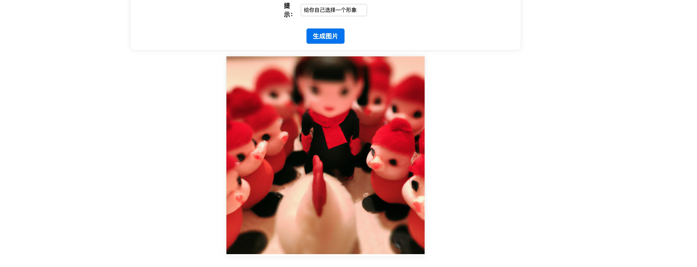

本 readme 文件使用 ChatGPT 自动生成 


# 自动生成图片

使用 koa 框架 + openai 库实现的自动生成图片的项目。

## 项目描述

这个项目旨在使用自然语言处理技术来自动生成图片。我们使用了 openai 库中的 dall-e 模型，该模型可以根据文本描述生成相应的图片。例如，当用户输入“一个猫坐在沙发上”时，系统会自动生成一张猫坐在沙发上的图片。

## 特点

- 使用 koa 框架实现了一个简单的 HTTP 服务器，提供图片生成的 RESTful API。
- 提供了一个前端页面，用于输入描述并生成图片。
- 使用了 CSS 和 JavaScript 动画效果美化了前端页面。

## 安装和使用

### 安装

首先，安装 Node.js 环境。然后，在项目根目录下运行以下命令安装依赖包：

```
npm install

```


### 配置

在使用 openai 库之前，你需要在 openai 官网上注册一个帐户，并获取一个 API 密钥。

将获取到的密钥填入 server.js 文件中：

```js
const { Configuration, OpenAIApi } = require("openai");

const configuration = new Configuration({
  apiKey: "你的 API 密钥",
});
const openai = new OpenAIApi(configuration);
```


### 运行
在项目根目录下运行以下命令启动项目：

```
npm start
```


项目启动后，你可以通过浏览器访问 http://localhost:3000 来使用项目。


## 示例
假设你已经启动了项目，并在浏览器中访问了 http://localhost:3000，你会看到一个类似下面的界面：



在输入框中输入“一个猫坐在沙发上”，然后点击“生成图片”按钮，页面上会展示出一张猫坐在沙发上的图片。


## 许可证
MIT 